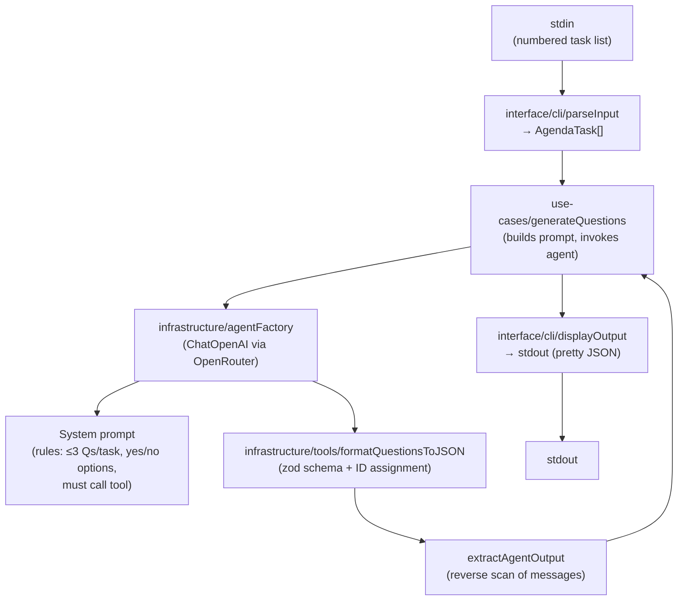

# Architecture — Smart Agent: Voting Question Generator

## Philosophy

This project is built around two core convictions:

**1. Clean Architecture enforces honesty about dependencies.**  
Every layer only knows about the layers below it. The domain knows nothing about LangChain. The use case knows nothing about stdin. This means you can replace the LLM provider, the CLI transport, or the serialisation tool independently — without touching business logic.

**2. TDD is a design activity, not just a testing activity.**  
Tests were written before implementation (Red → Green → Refactor). This forced every module to have a clear, testable contract before a single line of production code was written. The result is a codebase where each unit can be reasoned about in isolation.

---

## Tech Stack

| Concern | Choice |
|---|---|
| Language | TypeScript (strict mode) |
| Runtime | Node.js 20+ |
| LLM orchestration | LangChain v1 (`langchain`, `@langchain/core`, `@langchain/openai`) |
| LLM provider | OpenRouter (accessed via `ChatOpenAI` with a custom `baseURL`) |
| Tool schema validation | `zod` |
| Testing | Jest + `ts-jest` |
| Linting / formatting | ESLint + Prettier |
| Config | `dotenv` loading `.env.local` |

---

## Layer Structure

The project follows Clean Architecture with four layers, ordered from innermost (most stable) to outermost (most changeable):

```
src/
  domain/           ← Entities and shared types. Zero external dependencies.
  use-cases/        ← Application logic. Depends only on domain.
  infrastructure/   ← LangChain wiring (model, tools). Depends on domain.
  interface/        ← CLI I/O (stdin parser, stdout printer). Depends on domain.
  index.ts          ← Entrypoint. Wires all layers together.
```

### Dependency rule

```
interface  →  use-cases  →  infrastructure
    ↓              ↓               ↓
                domain  ←←←←←←←←←←←
```

No arrow ever points inward toward `domain` — the domain imports nothing from any other layer.

---

## Domain Layer (`src/domain/`)

The domain contains pure TypeScript types and interfaces. No functions, no side effects, no third-party imports.

### Entities

| Entity | Shape | Role |
|---|---|---|
| `AgendaTask` | `{ id: number; title: string }` | A single item from the meeting agenda |
| `VotingOption` | `{ id: string; label: string }` | One option inside a voting question (e.g. `opt_0 / "Yes"`) |
| `GeneratedQuestion` | `{ questionId, question, options, reasoning }` | A fully structured question ready to display |

### Shared types (`types.ts`)

```
AgentInput   { tasks: AgendaTask[] }           ← what enters the use case
AgentOutput  { questions, totalQuestions, generatedAt }  ← what leaves the use case
RawQuestion  { question, options[], reasoning }  ← intermediate shape before ID assignment
```

`RawQuestion` is the bridge between the LLM's raw output and the structured `GeneratedQuestion`. The agent produces `RawQuestion[]` via its tool call; the tool converts them into `AgentOutput`.

---

## Use Case Layer (`src/use-cases/generate-questions/`)

### `generateQuestions(input: AgentInput): Promise<AgentOutput>`

This is the single use case in the system. Its responsibility is:

1. Guard against empty input.
2. Build a natural-language prompt from the task list.
3. Invoke the agent.
4. Extract a valid `AgentOutput` from the agent's message history.

**Key design decision — reverse message scan:**  
The agent can return a multi-message response where the last message is a human-readable summary, not the tool's JSON output. `extractAgentOutput` iterates from the last message backwards, skipping non-string content and invalid JSON, until it finds a message whose content parses into a valid `AgentOutput` shape. This makes the use case robust to different LLM response styles.

```typescript
// Scans from newest to oldest; returns the first valid AgentOutput found
function extractAgentOutput(messages: Array<{ content: unknown }>): AgentOutput
```

---

## Infrastructure Layer (`src/infrastructure/`)

### `agentFactory.ts` — `buildAgent()`

Builds a LangChain `createAgent` instance wired with:
- `ChatOpenAI` configured for **OpenRouter** (custom `baseURL`, auth headers)
- The `formatQuestionsToJSONTool` as the only available tool
- A system prompt that instructs the model's behaviour

All required environment variables are validated eagerly at call time, throwing descriptive errors before any API call is made.

**Environment variables:**

| Variable | Purpose |
|---|---|
| `OPENROUTER_API_KEY` | Auth token |
| `OPENROUTER_MODEL` | Model identifier (e.g. `openai/gpt-4o-mini`) |
| `OPENROUTER_BASE_URL` | OpenRouter API base URL |
| `OPENROUTER_TEMPERATURE` | Sampling temperature (default `0`) |
| `OPENROUTER_HTTP_REFERER` | Optional — passed as `HTTP-Referer` header |
| `OPENROUTER_APP_TITLE` | Optional — passed as `X-Title` header |

### `tools/formatQuestionsToJSON.ts` — two exports

This file deliberately exposes **two separate exports**:

| Export | Type | Purpose |
|---|---|---|
| `formatQuestionsToJSON` | Pure function | Validates input, assigns IDs, builds `AgentOutput`, returns JSON string. Testable without LangChain. |
| `formatQuestionsToJSONTool` | LangChain `tool()` wrapper | Wraps the pure function with a `zod` schema for the agent to call. |

This split allows the core transformation logic to be unit-tested as a plain function, while the LangChain binding is tested separately via a thin integration test.

**What the tool does:**
- Assigns sequential `questionId`s in format `q_001`, `q_002`, …
- Maps each option string to a `VotingOption` with `opt_0`, `opt_1`, … IDs
- Adds an ISO timestamp (`generatedAt`)
- Returns a JSON string containing the full `AgentOutput`

**Why a tool enforces structure:**  
Rather than parsing free-form LLM output with fragile regexes, the agent is instructed to always call `format_questions_to_json`. This delegates structure enforcement to the tool's `zod` schema, making malformed output a hard error rather than a silent bug.

---

## Interface Layer (`src/interface/cli/`)

### `parseInput(raw: string): AgendaTask[]`

Parses a numbered list from stdin into `AgendaTask[]`.

```
"1. Sprint planning\n2. Retrospective"
  → [{ id: 1, title: "Sprint planning" }, { id: 2, title: "Retrospective" }]
```

Guards: throws on empty input, throws if no valid numbered lines are found. Trims whitespace, skips blank lines.

### `displayOutput(output: AgentOutput): void`

Prints the final `AgentOutput` to stdout as pretty-printed JSON (`JSON.stringify(output, null, 2)`). Intentionally trivial — its only job is to separate I/O from logic.

---

## CLI Entrypoint (`src/index.ts`)

```
stdin
  └─ readStdin()
       └─ parseInput()          → AgendaTask[]
            └─ generateQuestions()   → AgentOutput
                 └─ displayOutput()
                      └─ stdout
```

Loads `.env.local` before any imports that might need env vars. Reads all of stdin, then orchestrates the three steps synchronously in order. All errors propagate to a top-level `catch` that prints to stderr and exits with code `1`.

---

## Data Flow (end-to-end)



---

## Testing Strategy

Tests follow the TDD discipline (Red → Green → Refactor) and are split by type:

| Module | Test type | What is mocked |
|---|---|---|
| `parseInput` | Unit | Nothing — pure function |
| `formatQuestionsToJSON` | Unit | Nothing — pure function |
| `formatQuestionsToJSONTool` | Integration | Nothing — invokes the real LangChain tool wrapper |
| `agentFactory` | Unit | `ChatOpenAI`, `createAgent` |
| `displayOutput` | Unit | `console.log` (spy) |
| `generateQuestions` | Integration | `buildAgent` (returns a mock `invoke`) |

**Why mock `buildAgent` in the use-case test, not the model?**  
Mocking at the `buildAgent` boundary means the integration test validates the full logic of `generateQuestions` — prompt formatting, message scanning, error handling — without any network calls. It is an integration test in the sense that it exercises the real use-case code end-to-end within the process.

Coverage target: ≥ 90% across all modules.

---

## Key Design Decisions

| Decision | Rationale |
|---|---|
| Tool-enforced structured output | Avoids fragile regex parsing; the `zod` schema is the contract |
| Reverse message scan in `extractAgentOutput` | LLMs often append a prose summary after the tool result; scanning backwards finds the JSON reliably |
| Pure function + LangChain wrapper split | Keeps core logic testable without LangChain as a dependency |
| Eager env var validation in `buildAgent` | Fails fast with a clear message before any API call |
| `dotenv` loaded before all other imports in `index.ts` | Guarantees env vars are available to modules at import time |
| No framework for CLI | `readline` from Node stdlib is sufficient; avoids dependency bloat |
