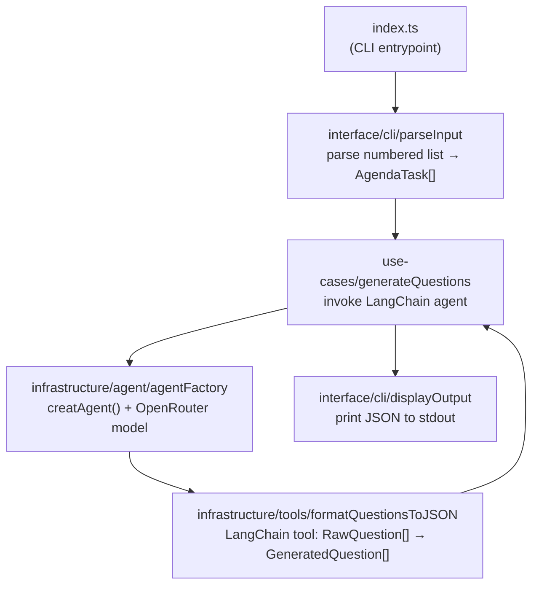

# Smart Agent — Voting Question Generator

## Stack & Environment

- TypeScript + Node.js 20+
- LangChain v1 (`langchain`, `@langchain/core`, `@langchain/openai` — already installed)
- OpenRouter via `@langchain/openai` (`baseURL` + `OPENROUTER_*` env vars from `[.env.local](03-smart-agent/.env.local)`)
- `zod` for tool schemas (as in LangChain quickstart)
- Jest + `ts-jest` for TDD (per [SKILL.md](03-smart-agent/.cursor/skills/defining-tdd/SKILL.md))
- ESLint + Prettier for linting

## Project Structure (Clean Architecture)

```
03-smart-agent/
  src/
    domain/
      entities/
        AgendaTask.ts          # AgendaTask { id, title }
        Question.ts            # GeneratedQuestion { questionId, question, options, reasoning }
        VotingOption.ts        # VotingOption { id, label }
      types.ts                 # AgentInput, AgentOutput, RawQuestion interfaces
    use-cases/
      generate-questions/
        generateQuestions.ts           # Core use case: invokes agent, returns AgentOutput
        __tests__/
          generateQuestions.unit.test.ts
          generateQuestions.integration.test.ts
    infrastructure/
      agent/
        agentFactory.ts        # createAgent() wired with OpenRouter model + tool
      tools/
        formatQuestionsToJSON.ts       # LangChain tool definition
        __tests__/
          formatQuestionsToJSON.unit.test.ts
    interface/
      cli/
        parseInput.ts          # Parses "1. Task\n2. Task" → AgendaTask[]
        displayOutput.ts       # Prints final JSON to stdout
        __tests__/
          parseInput.unit.test.ts
  index.ts                     # CLI entrypoint (reads stdin, calls use case, displays output)
  tsconfig.json
```

## Architecture Flow




## Key Implementation Details

### 1. `formatQuestionsToJSON` Tool

Defined using `tool()` from `langchain` with a `zod` schema. The agent calls this tool to structure its raw output:

```typescript
import { tool } from "langchain";
import * as z from "zod";

const formatQuestionsToJSON = tool(
  (input) => { /* generate IDs, map options, add timestamp */ },
  {
    name: "format_questions_to_json",
    description: "Formats raw questions into structured JSON for voting",
    schema: z.object({
      questions: z.array(z.object({
        question: z.string(),
        options: z.array(z.string()),
        reasoning: z.string(),
      }))
    }),
  }
);
```

### 2. `agentFactory` (infrastructure)

Uses `createAgent` from `langchain` with `ChatOpenAI` configured for OpenRouter:

```typescript
import { createAgent } from "langchain";
import { ChatOpenAI } from "@langchain/openai";

const model = new ChatOpenAI({
  model: process.env.OPENROUTER_MODEL,
  apiKey: process.env.OPENROUTER_API_KEY,
  configuration: { baseURL: process.env.OPENROUTER_BASE_URL },
  temperature: Number(process.env.OPENROUTER_TEMPERATURE),
});

export const buildAgent = () => createAgent({ model, tools: [formatQuestionsToJSON], systemPrompt });
```

### 3. `parseInput` (interface/cli)

Parses the numbered list from CLI args or stdin into `AgendaTask[]`:

```
"1. Sprint planning\n2. Retrospective" → [{ id: 1, title: "Sprint planning" }, ...]
```

### 4. System Prompt

Instructs the agent to generate ≤3 voting questions per task, always call `format_questions_to_json`, and produce yes/no options.

## TDD Order (per SKILL.md Red → Green → Refactor)

For each module, the order is:

1. Define use cases (MUST / MUST NOT)
2. Write failing tests
3. Confirm red
4. Implement minimum code
5. Confirm green
6. Refactor

Modules to test (in this order, simplest to most complex):

- `parseInput` — pure logic, no mocks needed
- `formatQuestionsToJSON` — pure logic (ID generation, mapping)
- `generateQuestions` — integration test with mocked `createAgent`

## Setup Tasks

- Add `TypeScript`, `ts-node`, `tsconfig.json` (`module: commonjs`, `strict: true`)
- Add `jest`, `ts-jest`, `@types/jest`
- Add `zod` (tool schemas)
- Add `dotenv` (load `.env.local`)
- Add `eslint` + `prettier`
- Update `package.json` scripts (`build`, `start`, `test`, `lint`)